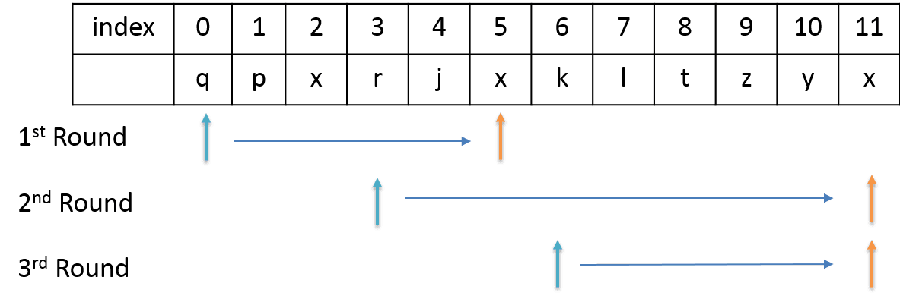

## 我的思路 

分两层进行遍历。第一层遍历确定 substr 起点，第二层确定终点，记录下当前最大的 substr 长度 current_max_length，下一次迭代时，只查找比 current_max_length 大的字符串。
Sun Dec 17 17:50:33 CST 2017


## 正确思路

 从左往右扫描，当遇到重复字母时，以上一个重复字母的index + 1，作为新的搜索起始位置。比如



```python
class Solution(object):
    def lengthOfLongestSubstring(self, s):
        """
        :type s: str
        :rtype: int
        """
        start = 0
        maxLength = 0
        
        usedChar = {}
        for i in range(len(s)):
            if (s[i] in usedChar and start <= usedChar[s[i]]):
                start = usedChar[s[i]] + 1
            else:
                maxLength = max(maxLength, i - start + 1)               
            usedChar[s[i]] = i
            
        return maxLength
```